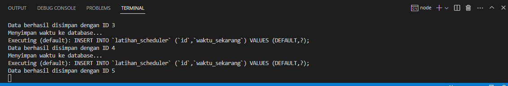
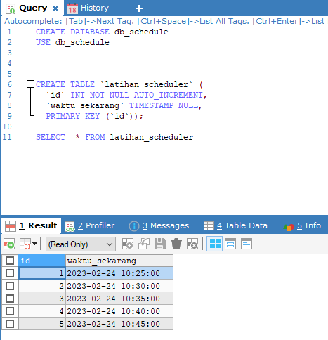

# node_schedule
Latihan crontab untuk scheduler event di NodeJS

Installasi depedensi
```bash
npm install
```

Run program
```
nodemon index
```

#### Screenshoot Output
Output Node


#### Screenshoot 2



Table Record
